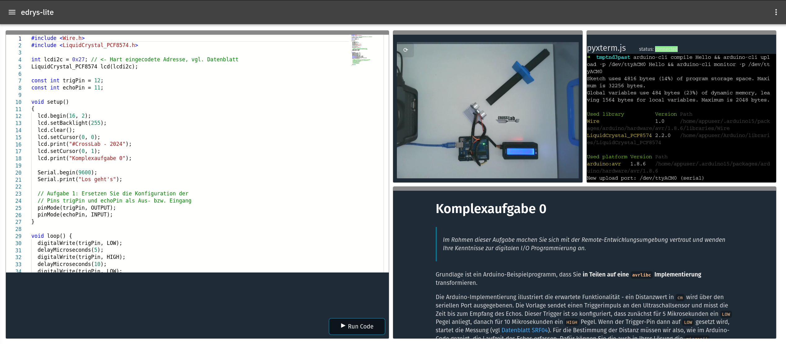

# Lab - TUBAF: Embedded Systems

Remote laboratories for the "Embedded Systems" course at TU Bergakademie Freiberg.
Reuse these labs for your own courses or self-study.

Import the configuration files into a newly created lab on https://edrys-labs.github.io or use the Deploy-Lab buttons below.

## Station Setup

To run a station, use the [pyxtermjs](https://github.com/edrys-labs/module-pyxtermjs) terminal server in a secure Docker environment:

```bash
docker run -it -p 5000:5000 --device=/dev/ttyACM0:/dev/ttyACM0 edryslabs/module-pyxtermjs:latest
```

Alternatively, set up your own Docker environment or use the terminal server directly with Python.
See: https://github.com/edrys-labs/module-pyxtermjs

## Task 1: Ultrasonic Distance Measurement

Students implement ultrasonic sensor control with two difficulty tracks:

- **Track A (Fundamentals)**: Low-level sensor control, GPIO timing, pulse measurement, distance calculation
- **Track B (Library Integration)**: NewPing library, user configuration, LCD menus, unit conversion

**Hardware**: Arduino Uno, HC-SR04 ultrasonic sensor, 16×2 LCD display (I2C)

**Learning**: Sensor communication, timing signals, datasheet analysis, display interfaces

[](https://edrys-labs.github.io/?/deploy/https://raw.githubusercontent.com/edrys-labs/lab-tubaf-embedded-systems/main/laboratory/de/task-1.yaml)

https://raw.githubusercontent.com/edrys-labs/lab-tubaf-embedded-systems/main/laboratory/de/task-1.yaml



## Task 2: ADC-Based Distance Scanner

Students build a 180° rotating infrared scanner by replacing `analogRead()` with direct ADC register manipulation.

**Tasks**:
- Refactor code into reusable functions
- Configure ADC registers (`ADMUX`, `ADCSRA`) directly
- Transform voltage readings to distance (cm) using sensor datasheet
- Visualize measurements on radar-style plot

**Hardware**: Arduino Uno, Sharp GP2Y0A02 infrared sensor, servo motor

**Learning**: Register-level ADC programming, sensor calibration, code refactoring

[](https://edrys-labs.github.io/?/deploy/https://raw.githubusercontent.com/edrys-labs/lab-tubaf-embedded-systems/main/laboratory/de/task-2.yaml)

https://raw.githubusercontent.com/edrys-labs/lab-tubaf-embedded-systems/main/laboratory/de/task-2.yaml


## Task 3: Interrupt-Driven Motor Control

Students replace polling with interrupt-based programming to synchronize stepper motor position with LED visualization.

**Tasks**:
- Implement ISR for Hall sensor (falling edge trigger)
- Use `volatile` for shared variables between main code and ISR
- Map motor position (2048 steps) to LED ring (24 LEDs)
- Remove polling logic, rely on interrupt-driven position reset

**Hardware**: Arduino Uno, 28BYJ-48 stepper motor, ULN2003 driver, Hall sensor, Adafruit NeoPixel LED ring (24 LEDs)

**Learning**: Interrupt configuration, ISR programming, motor control, visual feedback synchronization

[](https://edrys-labs.github.io/?/deploy/https://raw.githubusercontent.com/edrys-labs/lab-tubaf-embedded-systems/main/laboratory/de/task-3.yaml)

https://raw.githubusercontent.com/edrys-labs/lab-tubaf-embedded-systems/main/laboratory/de/task-3.yaml


## More Information

For detailed explanations of each lab, see the blog posts:
- [Ultrasonic Distance Measurement Lab](https://edrys-labs.github.io/blog/posts/021_remote-lab-distance-measurement/)
- [ADC Distance Scanner Lab](https://edrys-labs.github.io/blog/posts/022_remote-lab-adc-scanner/)
- [Interrupt Motor Control Lab](https://edrys-labs.github.io/blog/posts/023_remote-lab-interrupts-motor/)
